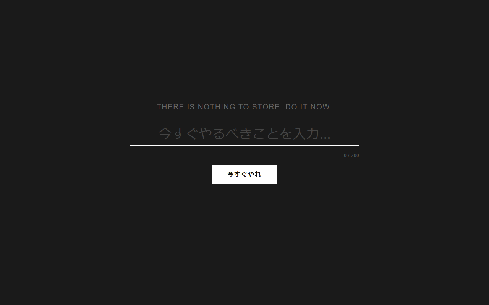
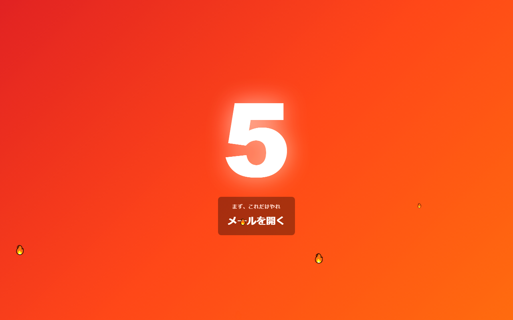
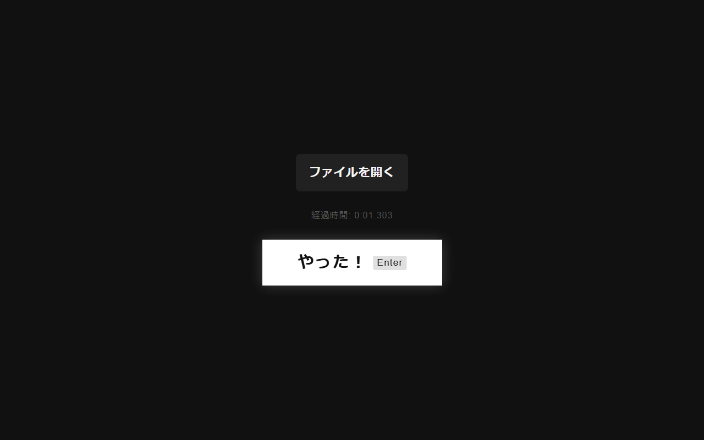

# Nothing To Do App

> タスクを保存するな。今すぐやれ。

従来のToDoアプリへのアンチテーゼ。タスクを入力した瞬間、AIが「今すぐやれ」と叱咤し、5秒カウントダウンで即行動を強制するジョークWebアプリ。

**🔗 https://nothing-to-do-app.pages.dev/**

## Screenshots

| Input | Screaming (urgency 1) | Screaming (urgency 2) | Screaming (urgency 3) | Monitoring |
|---|---|---|---|---|
|  |  |  |  |  |

## UX Flow

```
[Input]      入力フォーム + 今日の完了履歴
    ↓ 送信
[Screaming]  緊急度に応じた背景色・炎エフェクト、5秒カウントダウン + 音声
    ↓ 5秒後
[Monitoring] 「やった！」ボタン、経過時間カウント、放置すると督促
    ↓ やった！
[Input]      履歴に追加
```

## Urgency Level

AIがタスクの緊急度を1〜3で判定し、演出が変わる。

| Level | 背景色 | 炎の数 | パルス速度 |
|-------|--------|--------|------------|
| 1 — 普通 | 青 | 5個 | ゆっくり |
| 2 — 急ぎ | オレンジ赤 | 10個 | 普通 |
| 3 — 今すぐ | 深紅 | 18個 | 速い |

## Tech Stack

| | |
|--|--|
| Frontend | Vite + Vanilla TypeScript |
| Backend | Express + Anthropic SDK |
| AI | Claude API (claude-3-5-sonnet) |
| Voice | Web Speech API |
| Hosting (front) | Cloudflare Pages |
| Hosting (back) | Google Cloud Run |

## Getting Started

### 1. 環境変数を設定

```bash
cp .env.example .env
# ANTHROPIC_API_KEY を記入

cp client/.env.example client/.env
# 開発時は VITE_API_BASE_URL=http://localhost:3001
```

### 2. 依存インストール・起動

```bash
cd server && npm install && npm run dev   # port 3001
cd client && npm install && npm run dev  # port 5173
```

## Deployment

### Backend → Cloud Run

```bash
gcloud run deploy nothing-to-do-api --source . --set-env-vars ANTHROPIC_API_KEY=xxx,CLIENT_ORIGIN=https://nothing-to-do-app.pages.dev
```

### Frontend → Cloudflare Pages

- ルートディレクトリ: `client`
- ビルドコマンド: `npm run build`
- 出力ディレクトリ: `dist`
- フレームワーク: None
- 環境変数: `VITE_API_BASE_URL` = Cloud Run の URL

## License

MIT
